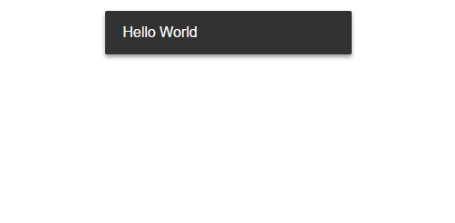

# siiimple-toast

[](https://badge.fury.io/js/siiimple-toast) []() []()



Easily replace console.log and alert in toast message
inspired by material design

## Getting Started
```
npm install --save siiimple-toast
```

## Demo

[https://gomonk3037.github.io/siiimple-toast/](https://gomonk3037.github.io/siiimple-toast/)

## Usage

### Parameter

change message direction <br>

vertical: top, bottom <br>
horizontal: left, center, right <br>

### Style (Required in v2.0.0)

Insert this css code into your stylesheet (**src/style.css**)

```css

.siiimpleToast {
  position: fixed;
  padding: 1rem 1.2rem;
  min-width: 17rem;
  z-index: 10;
  border-radius: 2px;
  color: white;
  font-weight: 300;
  white-space: nowrap;
  pointer-events: none;
  opacity: 0;
  box-shadow: 0 3px 6px rgba(0, 0, 0, 0.16), 0 3px 6px rgba(0, 0, 0, 0.23);
  transform: scale(0.5);
  transition: all 0.4s ease-out;
}

/* vertical style */
.siiimpleToast.top {
  top: -100px;
}

.siiimpleToast.bottom {
  bottom: -100px;
}

/* horizontal style */
.siiimpleToast.left {
  left: 1rem;
}

.siiimpleToast.center {
  left: 50%;
  transform: translateX(-50%) scale(0.5);
}

.siiimpleToast.right {
  right: 1rem;
}

/* message status */
.siiimpleToast.default {
  background-color: #323232;
}

.siiimpleToast.success {
  background-color: #8BC34A;
}

.siiimpleToast.alert {
  background-color: #d93737;
}

```

### Example

```javascript
import siiimpleToast from 'siiimple-toast';

const toast = new siiimpleToast();
// same 
const toast = new siiimpleToast({
  vertical: 'top',
  horizontal: 'center'
});

// default message
toast.message('Hello there'); 

// success message
toast.message('Successfully processed');

// alert message
toast.alert('Something seems to be wrong');

```
## Available

IE9+, Chrome, Opera

## License

This project is licensed under the MIT License